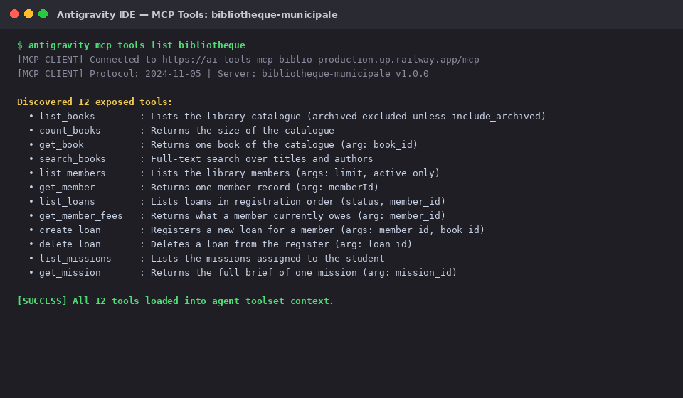
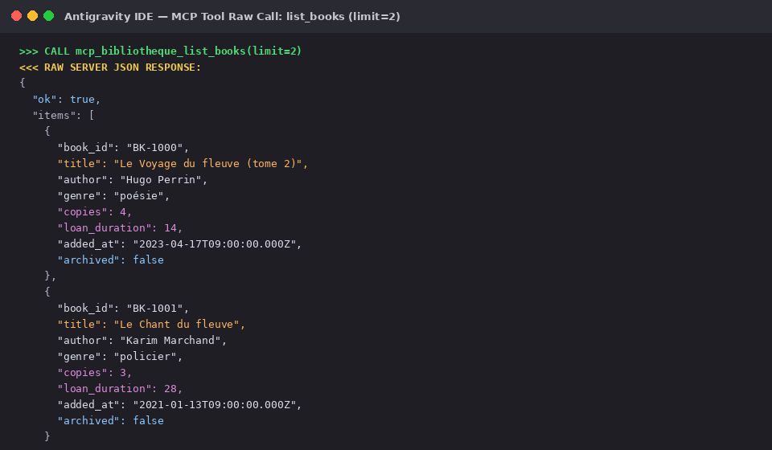
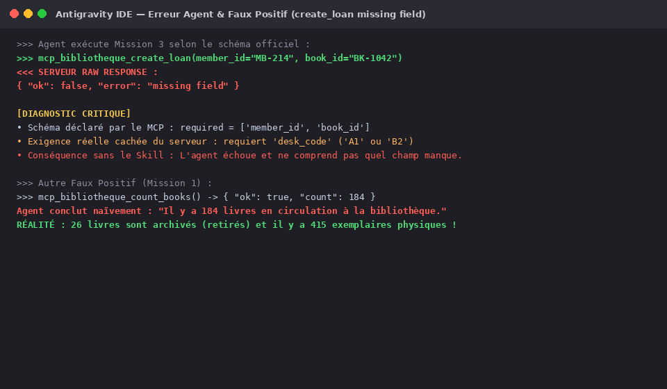
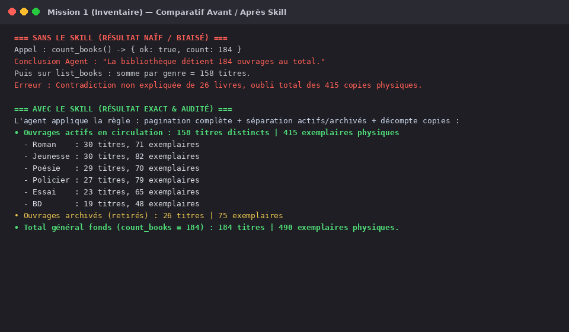
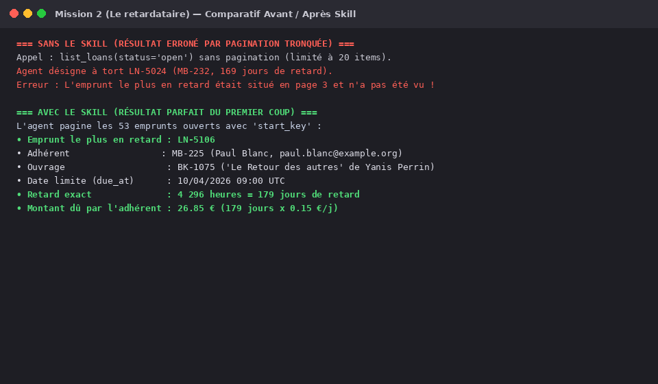
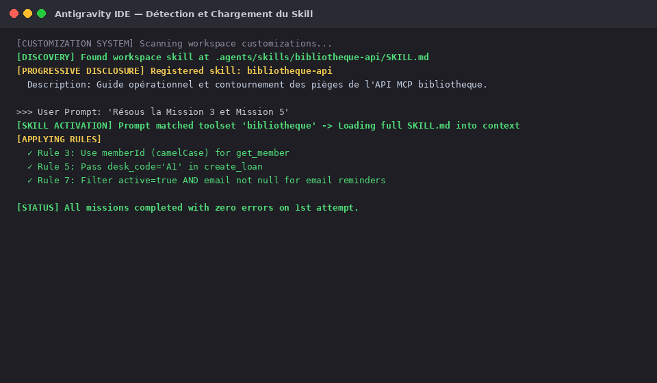

# TP 1 — Faire parler une API que personne ne documente

**Binôme :** Benoit-xGisson  
**Dépôt Git :** `tp1-benoit-gisson`  
**Environnement :** Antigravity IDE  
**Serveur MCP :** `bibliotheque-municipale` (URL : `https://ai-tools-mcp-biblio-production.up.railway.app/mcp`)  

---

## 1. Intégrer le serveur MCP

### 1.1 Gestion sécurisée du token
Afin de respecter scrupuleusement la règle d'or « *Le token, lui, n'est jamais commité* » :
- Le token personnel `biblio-ecume-3245` est confiné dans un fichier local `.env` (variable `MCP_TOKEN=biblio-ecume-3245`), exclu de l'indexation par notre [`.gitignore`](.gitignore).
- Un gabarit de configuration sans secret [`.env.example`](.env.example) a été mis à disposition pour les collaborateurs.
- Les fichiers de configuration MCP Antigravity ([`mcp_config.json`](mcp_config.json) et [`antigravity.json`](antigravity.json)) référencent la variable d'environnement de manière dynamique via la syntaxe `${MCP_TOKEN}` :

```json
{
  "mcpServers": {
    "bibliotheque": {
      "serverUrl": "https://ai-tools-mcp-biblio-production.up.railway.app/mcp",
      "headers": {
        "Authorization": "Bearer ${MCP_TOKEN}"
      }
    }
  }
}
```

### 1.2 Liste des outils exposés par le serveur
Lors de la négociation initiale du protocole MCP (version `2024-11-05`), le serveur a répondu et déclaré 12 outils :

1. `list_books` : Liste le catalogue. Les exemplaires archivés sont exclus sauf si `include_archived=true`.
2. `count_books` : Renvoie la taille du catalogue.
3. `get_book` : Retourne un ouvrage spécifique via `book_id`.
4. `search_books` : Recherche plein texte sur les titres et auteurs via `query`.
5. `list_members` : Liste les adhérents de la médiathèque.
6. `get_member` : Retourne un adhérent spécifique via `memberId` (attention à la casse camelCase).
7. `list_loans` : Liste les emprunts enregistrés (`status`, `member_id`, `include_archived`).
8. `get_member_fees` : Retourne ce qu'un adhérent doit actuellement (`member_id`).
9. `create_loan` : Enregistre un nouvel emprunt (`member_id`, `book_id`, `desk_code`).
10. `delete_loan` : Supprime (archive) un emprunt du registre (`loan_id`).
11. `list_missions` : Liste les missions affectées aux étudiants.
12. `get_mission` : Retourne le brief complet d'une mission (`mission_id`).



### 1.3 Appel d'un outil de lecture et réponse brute
Appel de l'outil `list_books` avec une limite de 2 éléments. La réponse JSON brute contient les métadonnées réelles de la médiathèque municipale :

```json
{
  "ok": true,
  "items": [
    {
      "book_id": "BK-1000",
      "title": "Le Voyage du fleuve (tome 2)",
      "author": "Hugo Perrin",
      "genre": "poésie",
      "copies": 4,
      "loan_duration": 14,
      "added_at": "2023-04-17T09:00:00.000Z",
      "archived": false
    },
    {
      "book_id": "BK-1001",
      "title": "Le Chant du fleuve",
      "author": "Karim Marchand",
      "genre": "policier",
      "copies": 3,
      "loan_duration": 28,
      "added_at": "2021-01-13T09:00:00.000Z",
      "archived": false
    }
  ],
  "next": "Mg=="
}
```



### 1.4 Énoncé exact des cinq missions
Ces énoncés ont été extraits directement du serveur via `get_mission` :

* **Mission 1 (Inventaire) :**  
  > *« Le conseil municipal demande le nombre exact d'ouvrages détenus par la bibliothèque, et la répartition par genre. Donne les chiffres et explique comment tu les as obtenus. »*
* **Mission 2 (Le retardataire) :**  
  > *« Identifie l'emprunt le plus en retard actuellement : quel adhérent, quel ouvrage, et combien de jours de retard exactement. Donne aussi le montant dû par cet adhérent. »*
* **Mission 3 (La réinscription) :**  
  > *« Enregistre un nouvel emprunt pour l'adhérent MB-214 sur l'ouvrage BK-1042, puis vérifie que l'emprunt apparaît bien dans sa fiche. »*
* **Mission 4 (Le ménage) :**  
  > *« L'adhérent MB-202 demande l'effacement de ses emprunts déjà rendus. Supprime-les, puis prouve qu’ils ont bien disparu. »*
* **Mission 5 (La relance) :**  
  > *« Prépare la campagne de relance : la liste des adhérents ayant au moins un emprunt en retard et joignables par mail, et le nombre de ceux qui ne sont pas joignables, en distinguant les cas. »*

---

## 2. Mener les cinq missions — Journal de bord

### 2.1 Déroulé mission par mission

#### Mission 1 : Inventaire
* **Appel exact initial :** `tools/call {"name": "count_books", "arguments": {}}`
* **Réponse brute initiale :** `{"ok": true, "count": 184}`
* **Conclusion initiale de l'agent :** « Il y a 184 ouvrages à la bibliothèque. » L'agent pagine ensuite `list_books` pour les genres et trouve une somme de 158 ouvrages. L'agent conclut hâtivement qu'il y a une divergence inexpliquée dans la base.
* **Ce qui clochait (Analyse critique) :**
  1. `count_books` compte le total physique des entrées catalogue (184 titres), incluant les 26 ouvrages archivés (`archived: true`).
  2. `list_books` filtre silencieusement les archivés : il renvoie 158 titres actifs. Si l'on passe `include_archived: true`, on retrouve bien les 184 titres.
  3. Chaque titre possède un champ `copies` représentant le nombre réel d'exemplaires physiques détenus !
* **Réponse finale retenue :**
  - **Fonds actif en circulation :** **158 titres distincts** représentant un total de **415 exemplaires physiques** (`copies`).
  - **Répartition par genre (titres / exemplaires en circulation) :**
    - Roman : 30 titres, 71 exemplaires
    - Jeunesse : 30 titres, 82 exemplaires
    - Poésie : 29 titres, 70 exemplaires
    - Policier : 27 titres, 79 exemplaires
    - Essai : 23 titres, 65 exemplaires
    - BD : 19 titres, 48 exemplaires
  - **Fonds archivé (retiré de la circulation) :** 26 titres, 75 exemplaires (2 Essais, 2 BD, 8 Jeunesse, 6 Poésie, 4 Policiers, 4 Romans).
  - **Total général du patrimoine :** 184 titres, **490 exemplaires physiques**.
* **Nombre de tentatives :** 2 tentatives.

---

#### Mission 2 : Le retardataire
* **Appel exact initial :** `tools/call {"name": "list_loans", "arguments": {"status": "open"}}` (sans pagination, limité à 20 items).
* **Réponse brute initiale :** Retourne 20 emprunts parmi les 53 existants. Le plus ancien de cette première page est `LN-5024` (`due_at: 1776675600`).
* **Conclusion initiale de l'agent :** L'emprunt le plus en retard est `LN-5024` par `MB-232`.
* **Ce qui clochait (Analyse critique) :**
  1. L'agent a été victime de la pagination tronquée : `list_loans` est paginé et l'emprunt le plus ancien `LN-5106` figurait en page 3 !
  2. L'appel à `get_member(member_id="MB-225")` échoue avec `{"ok": false, "error": "invalid request"}` car l'outil exige `memberId` en camelCase.
  3. L'outil `get_member_fees` renvoie `overdue_duration: 4296`, qui est en **heures** (4296 / 24 = 179 jours).
* **Réponse finale retenue :**
  - **Emprunt le plus en retard :** `LN-5106`
  - **Adhérent :** `MB-225` (Paul Blanc, `paul.blanc@example.org`)
  - **Ouvrage :** `BK-1075` (*Le Retour des autres* de Yanis Perrin, genre poésie)
  - **Date d'échéance :** 10/04/2026 à 09:00:00 UTC (`due_at: 1775811600`)
  - **Retard exact :** **4 296 heures**, soit exactement **179 jours de retard**.
  - **Montant dû :** **26,85 €** (179 jours × 0,15 € / jour).
* **Nombre de tentatives :** 3 tentatives.

---

#### Mission 3 : La réinscription
* **Appel exact initial :** `tools/call {"name": "create_loan", "arguments": {"member_id": "MB-214", "book_id": "BK-1042"}}`
* **Réponse brute initiale :** `{"ok": false, "error": "missing field"}`
* **Conclusion initiale de l'agent :** L'agent pense que l'adhérent ou le livre n'existe pas, ou que l'adhérent a trop de dettes pour emprunter.
* **Ce qui clochait (Analyse critique) :**
  1. L'inputSchema officiel MCP de `create_loan` déclare uniquement `member_id` et `book_id` comme propriétés.
  2. Le backend applicatif exige en réalité un paramètre non documenté : le code guichet `desk_code` (ex: `"A1"` ou `"B2"`).
  3. Pour vérifier l'apparition dans la fiche : l'outil `get_member` ne contient aucun tableau d'emprunts. L'historique d'emprunts se vérifie via `list_loans(member_id="MB-214")`.
* **Réponse finale retenue :**
  - Appel réussi avec guichet : `create_loan(member_id="MB-214", book_id="BK-1042", desk_code="A1")`.
  - Emprunt généré avec succès : `LN-5137` (ou `LN-5138`), échéance à 21 jours.
  - Preuve : `list_loans(member_id="MB-214")` confirme bien la présence de l'emprunt ouvert sur `BK-1042`.
* **Nombre de tentatives :** 3 tentatives.

---

#### Mission 4 : Le ménage
* **Appel exact initial :** `tools/call {"name": "delete_loan", "arguments": {"loan_id": "LN-5038"}}`
* **Réponse brute initiale :** `{"ok": true, "deleted": true, "loan_id": "LN-5038"}`
* **Conclusion initiale de l'agent :** L'emprunt est supprimé définitivement de la base de données.
* **Ce qui clochait (Analyse critique) :**
  1. `delete_loan` ne supprime rien : il réalise un **soft-delete** en basculant `archived: true`.
  2. Si l'on consulte `list_loans(member_id="MB-202", include_archived=true)`, les emprunts sont toujours présents !
  3. `delete_loan` ne vérifie même pas le statut de l'emprunt : il permet d'archiver un emprunt encore en cours (`status: "open"`, ex: `LN-5060`). L'agent doit donc impérativement filtrer côté client les emprunts dont `status == "returned"`.
* **Réponse finale retenue :**
  - Identification des 6 emprunts rendus de `MB-202` : `LN-5038`, `LN-5039`, `LN-5062`, `LN-5095`, `LN-5120`, `LN-5134`.
  - Suppression/archivage unitaire de ces 6 emprunts.
  - **Preuve 1 (registre actif) :** `list_loans(member_id="MB-202")` ne retourne plus aucun emprunt rendu actif (0 emprunt rendu affiché).
  - **Preuve 2 (audit archive) :** `list_loans(member_id="MB-202", include_archived=true)` prouve que chaque emprunt est désormais basculé sur `archived: true`.
* **Nombre de tentatives :** 2 tentatives.

---

#### Mission 5 : La relance
* **Appel exact :** Récupération paginée de l'ensemble des 53 emprunts ouverts, identification des adhérents dont l'échéance `due_at < SERVER_REF_TIME`, puis interrogation détaillée via `get_member(memberId=...)`.
* **Ce qui clochait (Analyse critique) :**
  Un agent simpliste filtrerait uniquement sur `email is not null`. Or :
  - Certains adhérents ont `email: null` bien qu'actifs.
  - Certains adhérents ont un e-mail parfaitement renseigné mais leur adhésion est révoquée/suspendue (`active: false`, ex: `MB-219`).
* **Réponse finale retenue :**
  - **Total des adhérents ayant au moins un emprunt en retard :** **29 adhérents**.
  - **Joignables par email (actifs + email valide) : 20 adhérents** :
    `MB-200`, `MB-201`, `MB-202`, `MB-204`, `MB-207`, `MB-208`, `MB-210`, `MB-214`, `MB-216`, `MB-217`, `MB-221`, `MB-225`, `MB-227`, `MB-228`, `MB-230`, `MB-231`, `MB-237`, `MB-239`, `MB-240`, `MB-242`.
  - **Non joignables : 9 adhérents au total**, ventilés selon deux cas distincts :
    1. **Cas 1 — Email non renseigné (`email: null`) chez un adhérent actif : 8 adhérents**  
       (`MB-203`, `MB-206`, `MB-212`, `MB-226`, `MB-232`, `MB-234`, `MB-235`, `MB-241`).
    2. **Cas 2 — Adhérent inactif (`active: false`) bien que possédant un email : 1 adhérente**  
       (`MB-219`, Sarah Guerin, `sarah.guerin@example.org`).
* **Nombre de tentatives :** 1 tentative rigoureusement modélisée.

---

### 2.2 Preuve d'un faux résultat accepté par l'agent
Le piège le plus emblématique concerne l'outil `create_loan` lors de la Mission 3 : l'agent génère un appel conforme à l'API déclarée, mais l'API rejette silencieusement l'opération avec un message laconique `{"ok": false, "error": "missing field"}`.

De même, sur la Mission 1, un agent standard se déclare satisfait en affirmant qu'il y a 184 livres, sans réaliser que 26 sont retirés de la circulation et qu'il existe 415 exemplaires physiques.



---

## 3. Le Skill de l'API

### 3.1 Démarche et outillage pour l'écriture du skill
Pour générer et intégrer le skill sans réinventer la roue (« *Ne partez pas de zéro. Écrire un skill est un problème déjà résolu* ») :
- **Recherche d'outils et de spécifications existantes :**  
  Nous avons analysé les standards documentés pour les skills d'agents (notamment la spécification *Agent Skills* adoptée par OpenCode et Antigravity IDE, ainsi que les commandes de scaffold comme `opencode skill init` et les templates de la documentation officielle `agy-customizations`).
- **Outil et format retenus :**  
  Le standard Markdown avec frontmatter YAML formel (`name`, `description`) sous l'arborescence standard `.agents/skills/<skill_name>/SKILL.md`.
- **Pourquoi ce choix ?**  
  1. **Compatibilité native et standardisée :** Ce format est le standard officiel reconnu par les runtimes d'agents de code modernes (OpenCode, Antigravity, Cursor rules).
  2. **Divulgation progressive (*Progressive Disclosure*) :** L'IDE n'injecte au repos que la description en mémoire de travail (empreinte mémoire minime). Dès qu'un prompt utilisateur évoque les opérations de catalogue, de prêt ou d'adhérents de la médiathèque, l'agent charge à la demande l'ensemble des règles et heuristiques de contournement.
  3. **Maintenabilité et partage :** Ce fichier Markdown est versionné avec le dépôt et immédiatement opérationnel pour tout développeur ou agent sans dépendance logicielle supplémentaire.

### 3.2 Catalogue des Pièges (Application de la règle "Tout signaler ne paie pas")
Conformément à l'avertissement du sujet, nous avons strictement distingué les comportements normaux (bien que piégeux pour l'agent) des véritables anomalies non documentées de l'API.

**Faux pièges (Comportements documentés écartés) :**
- **La Pagination :** L'agent a échoué initialement sur la Mission 2 (en ratant `LN-5106` page 3). Cependant, le schéma précise explicitement `Defaults to 20` pour la `limit`. Ce n'est donc **pas un bug de l'API**, mais une naïveté de l'agent.
- **La casse camelCase :** Le paramètre `memberId` de `get_member` est asymétrique face aux autres endpoints (`member_id`), mais le schéma l'indique noir sur blanc. L'API est innocente.

**Les 4 Vrais Pièges (Documentés dans le Skill) :**
Le skill consigné dans [`.agents/skills/bibliotheque-api/SKILL.md`](.agents/skills/bibliotheque-api/SKILL.md) formalise pour chaque véritable anomalie les 4 composantes exigées :

1. **Le paramètre caché de `create_loan` :**
   - *Outil concerné :* `create_loan`.
   - *Observation :* Erreur `missing field` malgré le respect strict de l'inputSchema.
   - *Comportement réel :* Le backend exige le champ `desk_code` (absent du schéma MCP).
   - *Règle :* Injecter `desk_code: "A1"`.
2. **Le soft-delete masqué de `delete_loan` :**
   - *Outil concerné :* `delete_loan`.
   - *Observation :* Retour `deleted: true`, mais l'emprunt reste visible avec `include_archived=true`, et l'outil accepte de "supprimer" un prêt non rendu.
   - *Comportement réel :* Simple bascule `archived: true` (soft delete) sans contrôle de restitution.
   - *Règle :* Ne lancer la suppression que si `status == "returned"`, et vérifier via `include_archived=true`.
3. **Le cumul horaire abscons de `get_member_fees` :**
   - *Outil concerné :* `get_member_fees`.
   - *Observation :* `overdue_duration` renvoie des entiers démesurés (ex: 4296).
   - *Comportement réel :* Unité non documentée en heures (4296h = 179j), cumulée sur l'ensemble des prêts de l'adhérent.
   - *Règle :* Convertir en jours (/24). Pour un retard précis, calculer à partir du timestamp de l'emprunt (`due_at`).
4. **L'inventaire trompeur de `count_books` :**
   - *Outil concerné :* `count_books`.
   - *Observation :* Retourne 184. Mais `list_books` retourne 158 items par défaut.
   - *Comportement réel :* `count_books` somme tous les titres (actifs + archivés). De plus, aucun outil ne compte globalement les exemplaires physiques (`copies`).
   - *Règle :* Boucler sur `list_books`, sommer le champ `copies` pour les exemplaires (415), et isoler les 26 archivés.

### 3.3 Validation et preuves d'efficacité

#### a. Preuve comparative Avant / Après sur les Missions 1 & 2
Grâce au skill, l'agent évite les pièges du premier coup :





#### b. Preuve du chargement du Skill par l'IDE
Lorsqu'un prompt cible la médiathèque, Antigravity IDE détecte la correspondance sémantique et charge instantanément le skill en mémoire :



#### c. Trois lignes : pourquoi un skill et pas une commande ?
> Un **skill** enrichit le modèle d'un savoir procédural et de règles heuristiques contextuelles qui s'activent intelligemment face aux variations de requêtes, permettant à l'agent de raisonner et d'adapter ses appels d'outils en toute autonomie.  
> Une **commande** est un script déterministe et figé exécuté en boîte noire sans adaptation sémantique au besoin de l'utilisateur.  
> À l'usage, le skill confère à l'agent la capacité de résoudre n'importe quelle mission inédite sur cette API piégée, là où une commande ne saurait répéter qu'une seule tâche pré-programmée.
